# FinTech Investor Behavior Analysis with Neo4j

*Vijay Singh · June 2026*

## Scenario

A FinTech customer wants to use graph technology to analyze client investment
data and identify clusters of investor behavior across cities. This repository
contains the complete solution: graph model, data loading pipeline, analytical
queries, and a proposed production architecture.

**Environment:** Neo4j AuraDB Free

---

## 1. Graph Model


```
(Customer)-[:LIVES_IN]->(City)
(Customer)-[:OWNS]->(Account {account_type})
(Account)-[:PURCHASED {purchase_id, number_of_shares, purchase_date, price_per_share}]->(Stock)
```

Full schema reference — all labels, properties, and types in one place:

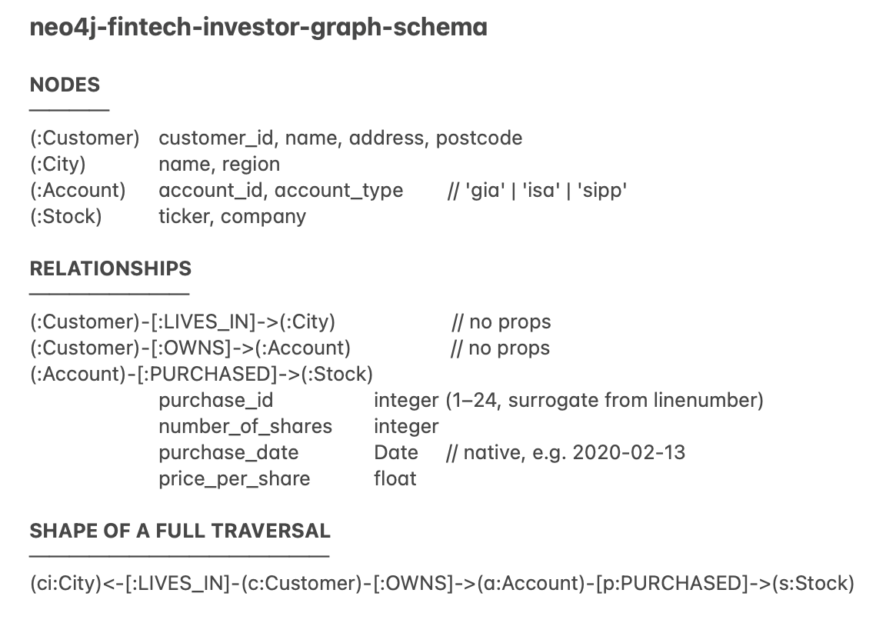

### Key modeling decisions

**City is a node, not a property.** The customer's core question — investor
behavior clusters *across cities* — makes City a first-class entity. As a node,
city-level traversals and aggregations are direct; as a string property they
would require repeated scans and grouping.

**PURCHASED is a relationship, not a node.** A purchase currently connects
exactly two entities (an account and a stock) and carries scalar facts. A
relationship is the most compact and traversal-efficient representation. If
purchases later need their own connections — to brokers, orders, settlements,
or to other purchases (e.g., wash-trade detection) — the model evolves by
promoting Purchase to a node. We model for known access patterns, not
hypothetical ones.

**Source denormalization resolved naturally.** `accounts.csv` repeats customer
name and address on every row. In the graph, those attributes live once, on
the Customer node — the graph model normalizes by construction.

---

## 2. Loading the Data: Two Approaches, One Lesson

Choosing a loading technique is itself a design decision worth explaining. I
evaluated both
of Neo4j's primary loading paths against the same model — and the comparison
surfaced a data-quality story worth telling.

### Approach A — Data Importer (visual, workshop-speed)

The Aura Data Importer is the fastest path from CSV to graph: drag files in,
draw the model, map columns, run. The reasonable mapping choices:


For clean, well-keyed node data it performed flawlessly — all customers,
cities, and stocks loaded correctly:


### The import reported success. The data tells a different story.


The success dialog itself records the discrepancy: **24 file rows,
23 relationships created.** Verified independently:


**Root cause #1 — missing purchase identity.** Two purchases on account
`123458` (ticker JPM, same date, different share counts) are indistinguishable
without a unique key, so the importer collapsed them into one relationship.
One purchase silently vanished.

**Root cause #2 — ambiguous date format.** Source dates are `DD/MM/YYYY`. The
importer assumed `MM/DD`:


Of 23 loaded purchases: **6 dates silently converted to the wrong date**
(`12/02/2017` → December 2nd instead of February 12th), **17 dates silently
dropped to null** (day > 12 cannot be a month), **0 dates correct**. The same
column produced two different failure modes with no error raised — the hardest
kind of corruption to detect downstream. In a financial context, purchase
dates shifted or missing is a compliance incident.

> The importer is excellent for clean, well-keyed, unambiguous data — the
> workshop scenario. The moment data has identity gaps or format ambiguity,
> you need explicit, scripted transformation. Knowing which situation you're
> in is the job.

### Approach B — Scripted `LOAD CSV` (explicit, repeatable, production-grade)

See [`cypher/01_load.cypher`](cypher/01_load.cypher). The script:

1. **Creates uniqueness constraints first** — identity enforcement plus
   index-backed lookups during load.
2. **Loads in dependency order** — reference data (Stock), then Customer +
   City, then Account, then PURCHASED.
3. **Merges purchases on a generated surrogate key** (`linenumber()`) — the
   source CSVs remain completely unmodified, so both loading approaches were
   tested against identical input. Same data, different engineering: the
   importer produced 23 relationships with 0 correct dates; the script
   produced 24 with 24.
4. **Parses dates explicitly** — `DD/MM/YYYY` decomposed and rebuilt as a
   native `Date` (no timezone artifacts, full date arithmetic in queries).
5. **Ends with verification queries** — node counts, relationship counts, and
   a spot-check of the duplicate that started the investigation.

**Result: 24/24 purchases, 24/24 correct dates.**

The full script executed cleanly end to end:

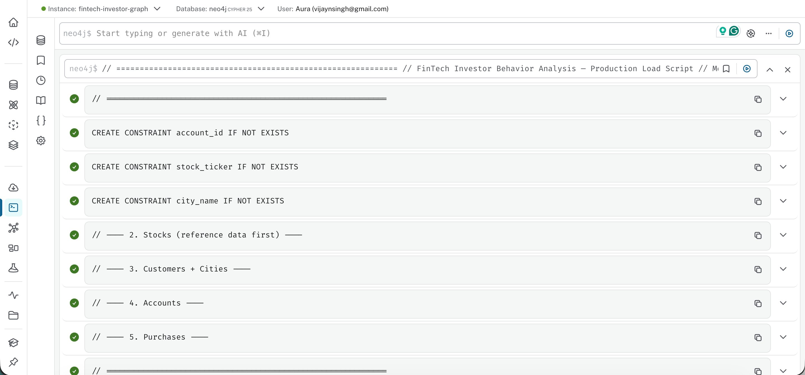

All 24 purchase relationships present — source row count and graph
relationship count reconcile exactly:

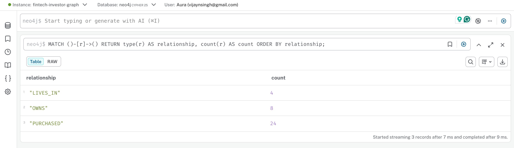

Every purchase date parsed correctly as a native `Date` — eight distinct
values spanning 2017–2023, zero nulls, zero timezone artifacts (compare with
the importer's result above):

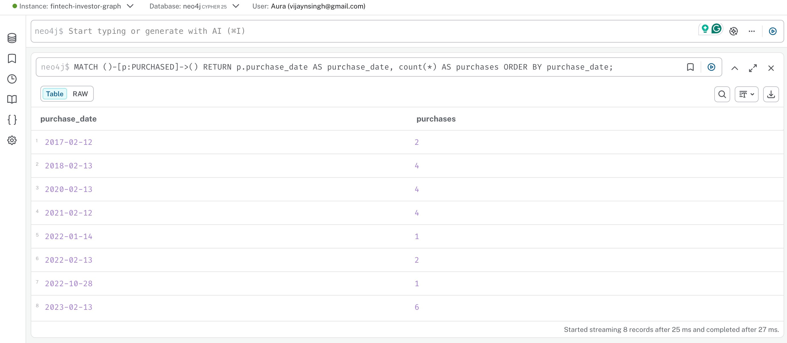

And the purchase the importer silently collapsed is back — both JPM purchases
on account `123458`, distinguished by their surrogate keys:

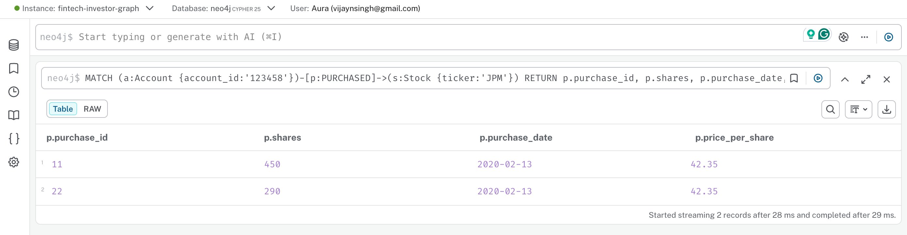

### Recommendation to the customer

The tactical fix (surrogate keys, explicit parsing) lives in the load script.
The durable fix lives in the **data contract**: source systems should emit a
unique purchase identifier and ISO-8601 dates (`YYYY-MM-DD`). Load tooling
should never have to guess.

---

## 3. Analytical Queries

All queries in [`cypher/02_queries.cypher`](cypher/02_queries.cypher).

### Required query 1 — customers who purchased Microsoft stock

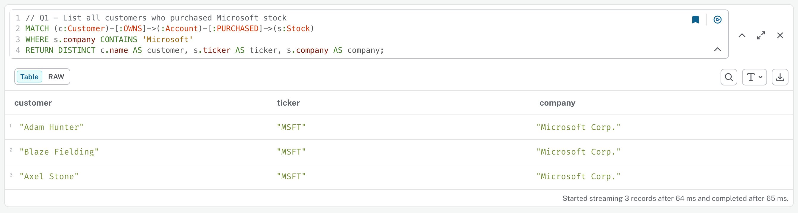

Three customers: **Adam Hunter, Blaze Fielding, Axel Stone**. The query
matches on `company CONTAINS 'Microsoft'` — the question as a business user
asks it — and returns the ticker as proof. `DISTINCT` matters: graph queries
return paths, and a customer buying through multiple accounts would otherwise
appear once per path.

### Required query 2 — city whose residents bought the most shares

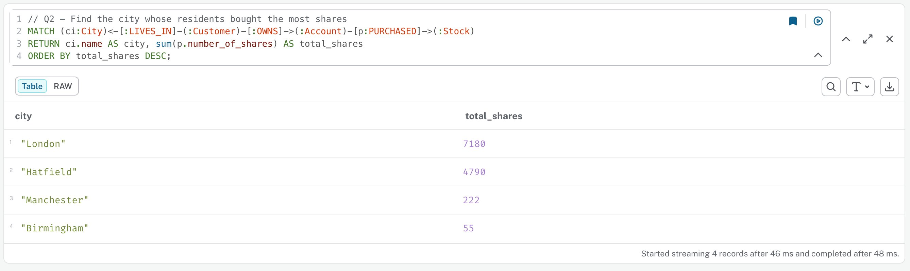

**London (7,180 shares)**, with Hatfield close behind (4,790). This is where
the City-as-node decision pays off — the traversal reads exactly like the
question, with no join gymnastics:

```
(City)<-[:LIVES_IN]-(Customer)-[:OWNS]->(Account)-[:PURCHASED]->(Stock)
```

### Beyond the brief: investigating the actual scenario

The customer's stated goal is *clusters of investor behavior across cities* —
so the open-ended queries each probe one axis of that question.

**IQ1 — Portfolio overlap.** Which customers invest alike?

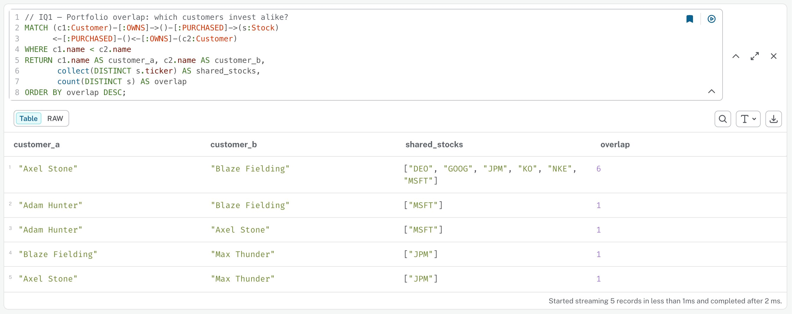

The result is not a gradient but a cliff: **Axel Stone and Blaze Fielding
share six holdings** (DEO, GOOG, JPM, KO, NKE, MSFT) while every other pair
overlaps on exactly one. The four investors split into a tightly-coupled pair
plus two satellites. This shared-neighbor pattern is awkward in SQL
(self-joins across three tables) and a one-liner in Cypher — and at production
scale it is precisely what feeds GDS node-similarity and community detection
(Louvain), which is the requested clustering, formalized.

**IQ2 — City investment profiles by value.** Share counts mislead — 100
shares of a £400 stock is not 100 shares of a £40 stock.

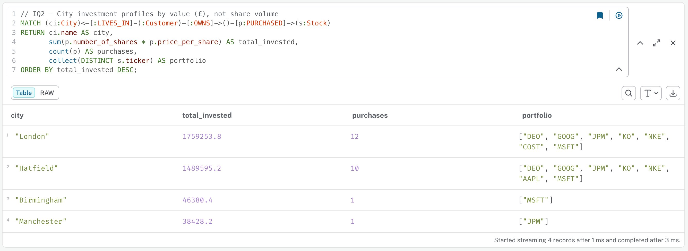

London leads in £ terms too (£1.76M), but the portfolios reveal the real
finding: **the behavioral twins live in different cities** — Blaze (Costco
buyer) in London, Axel (Apple buyer) in Hatfield. The two city portfolios are
near-identical *because* one member of the pair lives in each.
**Behavioral clusters cross city lines: similarity follows investors, not
geography.** The customer asked for clusters across cities; the graph answers
that geography is not the clustering dimension in this data.

**IQ3 — Tax-wrapper behavior.** A third segmentation axis.

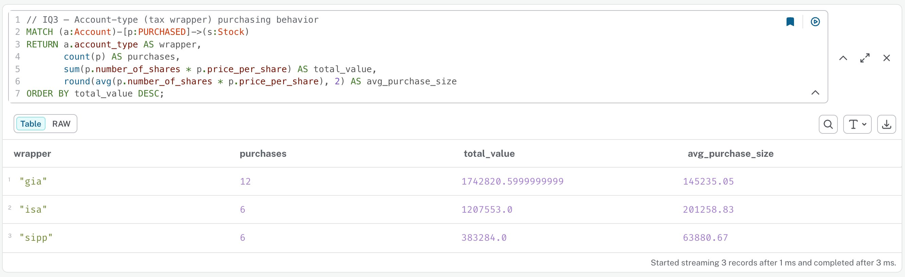

GIA accounts are the most active (12 purchases) but **ISA accounts write the
largest average ticket (£201k)** — tax-sheltered accounts here carry the
biggest individual commitments, while SIPPs (retirement) hold the smallest
(£64k). Note the floating-point artifact in the GIA total
(`…0.5999999999`): float arithmetic on money. In production, monetary values
should be stored as integer pence.

**IQ4 — Co-purchase pairs.** The recommendation-engine view.

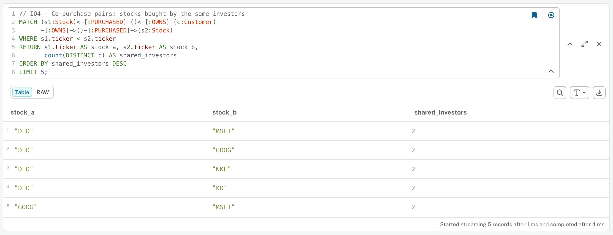

Every top pair (DEO–MSFT, DEO–GOOG, …) has exactly two shared investors — and
they are always the same two. The product-affinity signal in this dataset is
entirely generated by the behavioral pair found in IQ1: the same cluster, seen
from the stocks' side. "Customers who bought X also bought Y" is this exact
query at scale.

### Production path

These Cypher patterns are the manual versions of what the Graph Data Science
library industrializes: project the customer–stock graph, run node similarity
to weight customer pairs, run Louvain/Leiden for community detection, and
write cluster IDs back to Customer nodes — queryable alongside city, wrapper,
and portfolio for the full behavioral segmentation the customer described.

---

## 4. Proposed Solution Architecture

<!-- TODO Task 3:
     - primary architecture + one alternative
     - cloud deployment, fault tolerance, UI, Spark/Snowflake integration,
       monitoring, security
     - diagrams -->

---

## Repository Contents

| File | Purpose |
|---|---|
| `data/*.csv` | Source data — **unmodified**, exactly as provided |
| `cypher/01_load.cypher` | Production load script with constraints + verification |
| `cypher/02_queries.cypher` | Analytical queries: required + behavioral-clustering set |
| `images/part1/` | Loading investigation evidence |
| `images/part2/` | Script verification evidence |
| `images/part3/` | Query results |
| `README.md` | This document |
