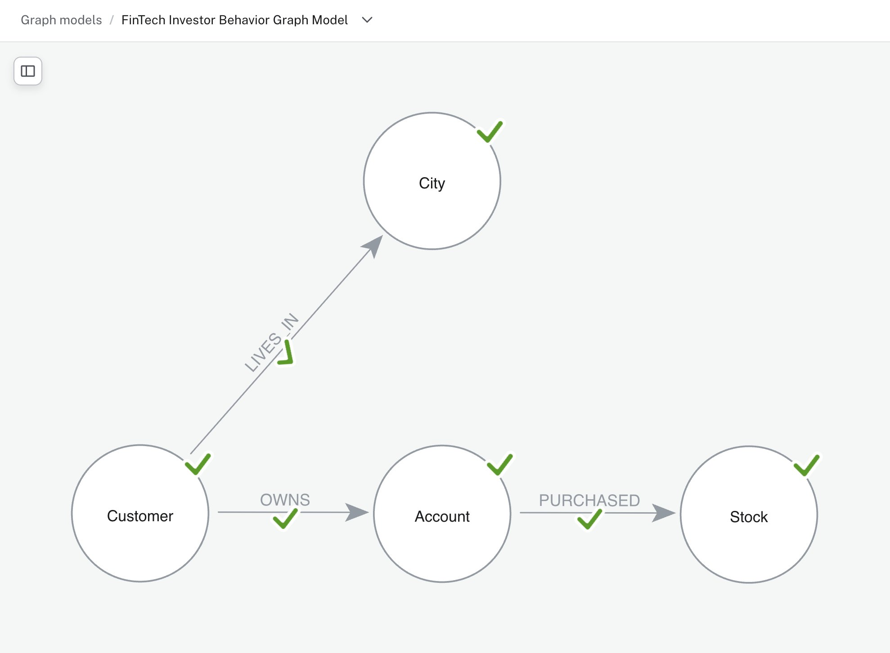
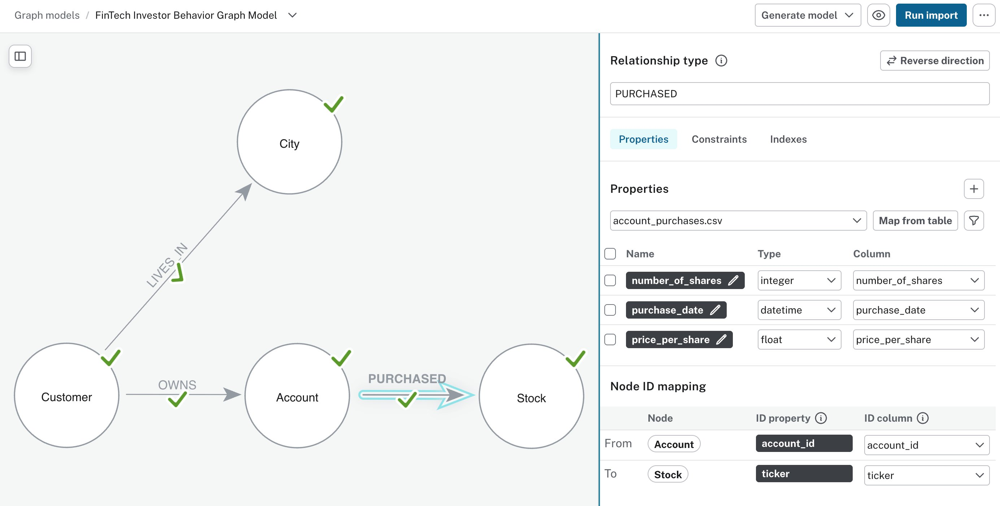
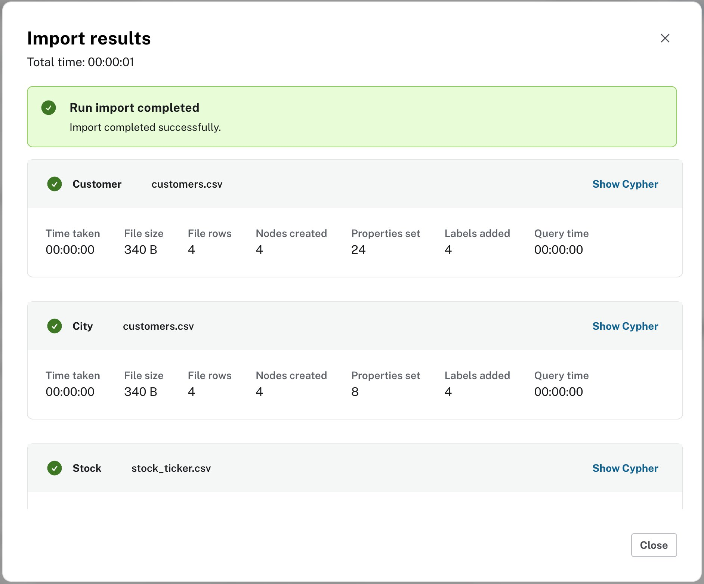
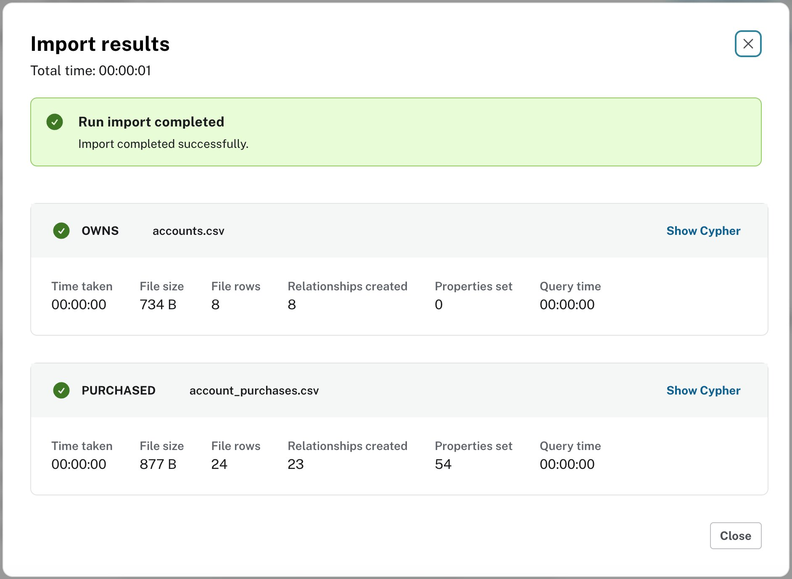
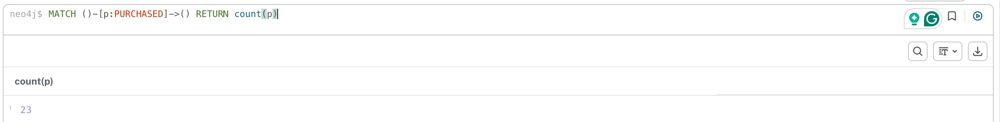
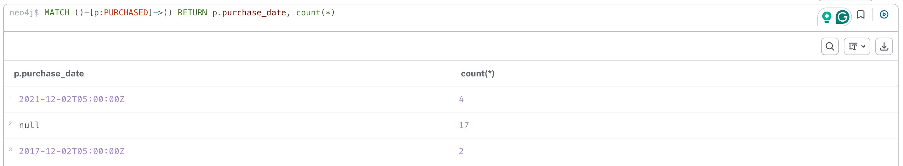

# FinTech Investor Behavior Analysis with Neo4j

**Neo4j Solution Engineering — Technical Exercise**
*Candidate: Vijay Singh · June 2026*

## Scenario

A FinTech customer wants to use graph technology to analyze client investment
data and identify clusters of investor behavior across cities. This repository
contains the complete solution: graph model, data loading pipeline, analytical
queries, and a proposed production architecture.

**Environment:** Neo4j AuraDB Free

---

## 1. Graph Model



```
(Customer)-[:LIVES_IN]->(City)
(Customer)-[:OWNS]->(Account {account_type})
(Account)-[:PURCHASED {purchase_id, shares, purchase_date, price_per_share}]->(Stock)
```

### Key modeling decisions

**City is a node, not a property.** The customer's core question — investor
behavior clusters *across cities* — makes City a first-class entity. As a node,
city-level traversals and aggregations are direct; as a string property they
would require repeated scans and grouping.

**PURCHASED is a relationship, not a node.** A purchase currently connects
exactly two entities (an account and a stock) and carries scalar facts. A
relationship is the most compact and traversal-efficient representation. If
purchases later need their own connections — to brokers, orders, settlements,
or to other purchases (e.g., wash-trade detection) — the model evolves by
promoting Purchase to a node. We model for known access patterns, not
hypothetical ones.

**Source denormalization resolved naturally.** `accounts.csv` repeats customer
name and address on every row. In the graph, those attributes live once, on
the Customer node — the graph model normalizes by construction.

---

## 2. Loading the Data: Two Approaches, One Lesson

The exercise asks for the loading technique to be explained. I evaluated both
of Neo4j's primary loading paths against the same model — and the comparison
surfaced a data-quality story worth telling.

### Approach A — Data Importer (visual, workshop-speed)

The Aura Data Importer is the fastest path from CSV to graph: drag files in,
draw the model, map columns, run. The reasonable mapping choices:



For clean, well-keyed node data it performed flawlessly — all customers,
cities, and stocks loaded correctly:



### The import reported success. The data tells a different story.



The success dialog itself records the discrepancy: **24 file rows,
23 relationships created.** Verified independently:



**Root cause #1 — missing purchase identity.** Two purchases on account
`123458` (ticker JPM, same date, different share counts) are indistinguishable
without a unique key, so the importer collapsed them into one relationship.
One purchase silently vanished.

**Root cause #2 — ambiguous date format.** Source dates are `DD/MM/YYYY`. The
importer assumed `MM/DD`:



Of 23 loaded purchases: **6 dates silently converted to the wrong date**
(`12/02/2017` → December 2nd instead of February 12th), **17 dates silently
dropped to null** (day > 12 cannot be a month), **0 dates correct**. The same
column produced two different failure modes with no error raised — the hardest
kind of corruption to detect downstream. In a financial context, purchase
dates shifted or missing is a compliance incident.

> The importer is excellent for clean, well-keyed, unambiguous data — the
> workshop scenario. The moment data has identity gaps or format ambiguity,
> you need explicit, scripted transformation. Knowing which situation you're
> in is the job.

### Approach B — Scripted `LOAD CSV` (explicit, repeatable, production-grade)

See [`cypher/01_load.cypher`](cypher/01_load.cypher). The script:

1. **Creates uniqueness constraints first** — identity enforcement plus
   index-backed lookups during load.
2. **Loads in dependency order** — reference data (Stock), then Customer +
   City, then Account, then PURCHASED.
3. **Merges purchases on a generated surrogate key** (`linenumber()`) — the
   source CSVs remain completely unmodified, so both loading approaches were
   tested against identical input. Same data, different engineering: the
   importer produced 23 relationships with 0 correct dates; the script
   produced 24 with 24.
4. **Parses dates explicitly** — `DD/MM/YYYY` decomposed and rebuilt as a
   native `Date` (no timezone artifacts, full date arithmetic in queries).
5. **Ends with verification queries** — node counts, relationship counts, and
   a spot-check of the duplicate that started the investigation.

**Result: 24/24 purchases, 24/24 correct dates.**

<!-- TODO Part 2: insert script verification screenshots
     - node/relationship counts showing PURCHASED = 24
     - clean date values
     - JPM spot-check showing both purchases alive -->

### Recommendation to the customer

The tactical fix (surrogate keys, explicit parsing) lives in the load script.
The durable fix lives in the **data contract**: source systems should emit a
unique purchase identifier and ISO-8601 dates (`YYYY-MM-DD`). Load tooling
should never have to guess.

---

## 3. Analytical Queries

<!-- TODO Task 2:
     Q1: customers who purchased Microsoft stock
     Q2: city whose residents bought the most shares
     Q3+: investor-behavior clustering queries (scenario-aligned)
-->

---

## 4. Proposed Solution Architecture

<!-- TODO Task 3:
     - primary architecture + one alternative
     - cloud deployment, fault tolerance, UI, Spark/Snowflake integration,
       monitoring, security
     - diagrams -->

---

## Repository Contents

| File | Purpose |
|---|---|
| `data/*.csv` | Source data — **unmodified**, exactly as provided |
| `cypher/01_load.cypher` | Production load script with constraints + verification |
| `cypher/02_queries.cypher` | Task 2 analytical queries *(coming in Part 2)* |
| `images/part1/` | Loading investigation evidence |
| `README.md` | This document |
